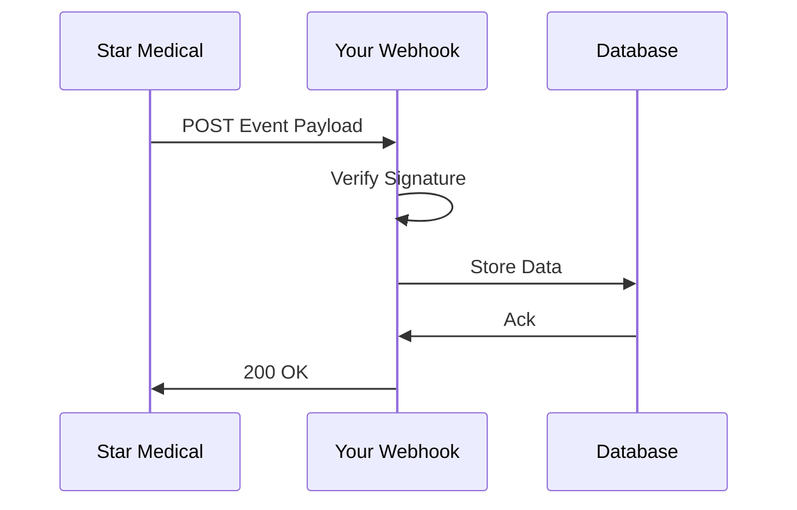

## Overview

Connect Star Medical Wellness to external services to automate workflows, sync patient data, and enhance your integrative medicine practice. Supported integrations include lab providers for automated test results, fitness trackers for real-time health metrics, webhooks for instant notifications, and telehealth platforms for virtual consultations.

<Callout kind="info">
  All integrations use secure OAuth 2.0 or API keys. Review your account permissions before connecting services.
</Callout>

## Lab Testing Providers

Link lab results directly into patient records from major providers.

<Columns cols={2}>
  <Card title="Quest Diagnostics" icon="database" href="/docs/lab-quest">
    Sync lab orders and results automatically.
  </Card>
  <Card title="LabCorp" icon="file-text" href="/docs/lab-labcorp">
    Import hormone panels and wellness metrics.
  </Card>
</Columns>

### Connect Quest Diagnostics

<Tabs>
  <Tab title="OAuth Flow" icon="key">
    <Steps>
      <Step title="Authorize App" icon="login">
        Visit `https://api.example.com/integrations/quest/authorize` and grant access.
      </Step>
      <Step title="Exchange Token" icon="refresh-cw">
        ```javascript
        const response = await fetch('https://api.example.com/oauth/token', {
          method: 'POST',
          body: new URLSearchParams({
            grant_type: 'authorization_code',
            code: 'AUTH_CODE',
            client_id: 'YOUR_CLIENT_ID'
          })
        });
        ```
      </Step>
      <Step title="Test Connection" icon="check-circle">
        Query `/v1/patients/{id}/labs` to verify data flow.
      </Step>
    </Steps>
  </Tab>
  <Tab title="API Key" icon="key-round">
    Use your Quest API key in headers: `X-API-Key: YOUR_QUEST_KEY`.
  </Tab>
</Tabs>

## Fitness Trackers and Apps

Integrate wearables to track weight loss progress and activity levels.

<Expandable title="Supported Trackers" default-open="true">
  - Fitbit: Steps, heart rate, sleep data
  - Apple Health: Export aggregated metrics
  - Google Fit: Android device sync
  - MyFitnessPal: Nutrition logging
</Expandable>

### Fitbit Integration Steps

<Steps>
  <Step title="Register App" icon="settings">
    Create a Fitbit app at developer.fitbit.com with redirect URI `https://api.example.com/callback`.
  </Step>
  <Step title="Sync Data" icon="download">
    <CodeGroup tabs="JavaScript,Python">
    ````javascript
    const accessToken = await getFitbitToken();
    const data = await fetch('https://api.fitbit.com/1/user/-/activities/steps/date/today/30d.json', {
      headers: { Authorization: `Bearer ${accessToken}` }
    }).then(r => r.json());
    // POST to Star Medical: https://api.example.com/v1/patients/{id}/fitness
    ````
    ````python
    import requests
    response = requests.get(
      'https://api.fitbit.com/1/user/-/activities/steps/date/today/30d.json',
      headers={'Authorization': f'Bearer {access_token}'}
    )
    # POST data to https://api.example.com/v1/patients/{id}/fitness
    ````
    </CodeGroup>
  </Step>
</Steps>

## Webhooks for Notifications

Set up webhooks to receive real-time updates on lab results, appointments, or patient milestones.

### Configuration

Navigate to your dashboard at `https://dashboard.example.com/settings/webhooks` and add your endpoint URL.

<ParamField path="webhook_url" param-type="string" required="true">
  Public HTTPS endpoint to receive events (e.g., `https://your-webhook-url.com/starmedical`).
</ParamField>

<ParamField header="StarMedical-Signature" param-type="string" required="false">
  HMAC SHA-256 signature for verification using your webhook secret.
</ParamField>



### Sample Payload Handling

<CodeGroup tabs="Node.js,Python">
````javascript
app.post('/webhook', (req, res) => {
  const signature = req.headers['starmedical-signature'];
  const payload = req.body; // { event: 'lab_result', patientId: '123', data: {...} }
  // Verify HMAC with your secret
  console.log('New lab result for patient', payload.patientId);
  res.status(200).send('OK');
});
````
````python
from flask import Flask, request
app = Flask(__name__)

@app.route('/webhook', methods=['POST'])
def webhook():
    signature = request.headers.get('StarMedical-Signature')
    payload = request.json  # { "event": "lab_result", "patientId": "123" }
    # Verify signature
    print(f"Lab result for patient {payload['patientId']}")
    return 'OK', 200
````
</CodeGroup>

<Callout kind="tip">
  Always verify webhook signatures to prevent spoofing. Use HTTPS only.
</Callout>

## Telehealth Platforms

Connect to platforms like Doxy.me or Zoom for seamless video consults tied to patient records.

<Columns cols={2}>
  <Card title="Doxy.me" icon="video" href="/docs/telehealth-doxy">
    Embed sessions in patient dashboards.
  </Card>
  <Card title="Zoom" icon="globe" href="/docs/telehealth-zoom">
    Auto-generate meeting links from appointments.
  </Card>
</Columns>

## Next Steps

<Callout kind="success">
  Test integrations in sandbox mode first. Contact support@starmedicalwellness.com for custom setups.
</Callout>